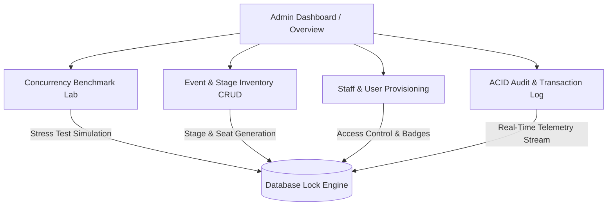

# Vibrance 2026 — Administrator Control & Telemetry Hub

Comprehensive technical documentation for the Admin portal covering executive analytics, concurrency simulation benchmarks, stage inventory CRUD, staff/user provisioning, and the ACID audit stream.

---

## 1. Admin Portal Overview & Workflow

The **Admin Portal** serves as the central control plane and database telemetry console for festival controllers, database lab coordinators, and security leads.



### Access Scope & Route Mapping
| Section | Route | Core Responsibilities |
| :--- | :--- | :--- |
| **Executive Dashboard** | `/admin` | Real-time KPI tiles, quick action navigation, per-event sales breakdown. |
| **Concurrency Simulation Lab** | `/admin/concurrency-lab` | Live multi-worker race condition testing (No Locking vs Strict 2PL vs OCC). |
| **Stage & Event Inventory** | `/admin/events` | Create, edit, delete events, configure seat capacity, upload custom ticket artwork. |
| **Staff & User Provisioning** | `/admin/users` | Register gate security staff, student profiles, assign badge IDs, and instant test login. |
| **System Audit Stream** | `/admin/audit-logs` | Live append-only immutable audit trail capturing all ACID commits, rollbacks, and gate checks. |

---

## 2. Executive Analytics & Dashboard (`/admin`)

### 2.1 Live Animated KPI Tiles
The top of the dashboard displays 5 core telemetry metrics rendered with real-time numeric count-up animations:
1. **Total Events**: Count of all active and concluded festival stages.
2. **Passes Issued**: Total confirmed and serialized digital passes generated.
3. **Total Revenue**: Aggregate ticketing volume computed dynamically from committed seat tiers ($\sum \text{amount}$).
4. **Contention Conflicts**: Real-time counter of intercepted lock collisions, double-booking attempts, and rollbacks.
5. **Check-in Rate**: Percentage of ticket holders who have successfully passed gate inspection ($\frac{\text{Checked-in}}{\text{Total Confirmed}} \times 100\%$).

### 2.2 Matching Quick Action Navigation Grid
Four compact action cards styled to match the KPI data dimensions:
- **Simulation Lab (`/admin/concurrency-lab`)**: Benchmark database isolation levels.
- **Inventory (`/admin/events`)**: Manage stages, total capacity, and pricing tiers.
- **Access Control (`/admin/users`)**: Provision security personnel and assign scanner badges.
- **Transactions (`/admin/audit-logs`)**: Inspect the live append-only transaction stream.

### 2.3 Event Inventory & Sales Breakdown Table
Real-time tabular summary listing all stages with:
- **Real-Time Stage Status**: `LIVE NOW`, `STARTING SOON`, `UPCOMING`, or `CONCLUDED`.
- **Seat Contention Progress Bar**: Color-coded visualization showing Booked (Red), Locked (Amber), and Available (Green) seats.
- **Revenue Generated**: Gross revenue per individual event stage.

---

## 3. Concurrency Simulation Lab (`/admin/concurrency-lab`)

The Concurrency Lab is an interactive benchmark environment simulating high-contention traffic spikes when popular shows open for booking.

```mermaid
sequenceDiagram
    autonumber
    actor Admin as Admin / Simulator
    participant Engine as Concurrency Engine
    participant DB as Database / Seat Table
    
    Admin->>Engine: Launch Simulation (50 Workers, Seat A-1)
    loop Concurrently for each worker
        Engine->>DB: Attempt Booking Request
        alt No Locking
            DB-->>Engine: All Read Available -> 50 Bookings Created (Overbooking!)
        alt Strict 2PL
            DB-->>Engine: Worker #1 Acquires X-Lock -> Workers #2-50 Blocked / 409 Conflict
        alt Optimistic CC (OCC)
            DB-->>Engine: Worker #1 Commits (Version=2) -> Workers #2-50 Abort (Version Mismatch)
        end
    end
    Engine-->>Admin: Render Execution Timeline, Latency & ACID Verification
```

### 3.1 Simulation Configuration
- **Concurrency Load**: Configurable worker pool (10, 25, 50, or 100 concurrent threads).
- **Target Seat**: Selection of specific high-contention seats (e.g. VIP Front Row `A-1`).
- **Isolation Strategy**:
  1. **No Locking (Naive)**: Demonstrates dirty reads, race conditions, and catastrophic overbooking ($>90\%$ anomaly rate).
  2. **Strict Two-Phase Locking (Strict 2PL)**: Demonstrates exclusive row locking (`X-Lock`), lock queues, and guaranteed serializability ($0.0\%$ overbooking).
  3. **Optimistic Concurrency Control (OCC)**: Demonstrates non-blocking version checks (`version = version + 1`) and conflict aborts ($0.0\%$ overbooking).

### 3.2 Side-by-Side Strategy Comparison
Allows running two strategies concurrently with identical seed data to compare:
- Total throughput and execution duration (ms).
- Success count vs. Conflict / Rollback count.
- Overbooking anomaly detection with visual failure flags.

---

## 4. Stage & Event Inventory Management (`/admin/events`)

Full CRUD lifecycle management for festival events, pricing tiers, and stage artwork.

### 4.1 Event Creation & Modification Modal
When creating (`handleCreateEvent`) or editing (`handleUpdateEvent`) a stage event:
- **Core Attributes**: Title, Category (`PRO_SHOW`, `EDM`, `DANCE`, `COMEDY`, `BATTLE_OF_BANDS`, `HACKATHON`), Headline Artist/Host, Base Price (₹), Venue Stage, Schedule Date & Time.
- **Automatic Seat Generation**: Automatically synthesizes tiered seating inventory (`VIP_FRONT` at $1.5\times$, `GOLD` at $1.25\times$, `REGULAR` at $1.0\times$) using `generateSeatsForEvent()`.
- **Ticket Background Photo Artwork**:
  - **Local File Upload**: Converts local image files to Base64 DataURLs via `FileReader` for offline portability.
  - **Custom Image URL**: Direct input for web-hosted image URLs.
  - **Vibrant Curated Presets**: 1-click stage presets (*Concert Stage*, *EDM Lasers*, *Dance Arena*, *Comedy Spotlight*, *Rock Band*, *Tech Matrix*).
  - **Live Mini Ticket Preview**: Real-time rendered preview of the ticket pass inside the modal before saving.

### 4.2 Interactive Row Inspection & Event Preview
- Clicking any event row or the **Inspect (Eye)** icon opens the **Event Details & Live Ticket Pass Preview Modal**, allowing administrators to inspect the attendee pass layout and schedule telemetry.

### 4.3 Safe Deletion & Cascade Handling
- Deleting an event prompts a confirmation modal with cascading warnings (releasing active locks and revoking uncommitted seat holds).

---

## 5. Staff & User Provisioning (`/admin/users`)

Manages role-based access control (RBAC) across the entire institution.

### 5.1 User Directory & Role Filtering
- Filterable directory supporting `All Roles`, `Gate Staff`, `Students`, and `Administrators`.
- Displays registration number/badge ID, department/security post, email, and provisioned timestamp.

### 5.2 User Provisioning Flow
- **Role Selection**: Provision users as `student`, `gate_staff`, or `admin`.
- **Badge ID Assignment**: Generates official Gate Security post identifiers (e.g. `STF-GATE-04`, `Post Alpha Security`).
- **Instant Test Login**: One-click **"Login As"** button to simulate and verify the exact portal view of any user without entering passwords.
- **Deprovisioning / Revocation**: Deprovisions user accounts with confirmation safeguards.

---

## 6. Real-Time ACID Audit Stream (`/admin/audit-logs`)

The audit log represents an **append-only, immutable transaction ledger** recording every critical database operation.

```
[TIMESTAMP] ──> [ACTION] ──> [USER / REG] ──> [EVENT / SEAT] ──> [STATUS / PROTOCOL] ──> [DETAILS]
```

### Logged Transaction Actions:
| Action Tag | Trigger Condition | Status Code |
| :--- | :--- | :--- |
| `BOOKING_CONFIRMED` | Seat successfully booked and committed under Strict 2PL. | `SUCCESS` |
| `SEAT_LOCKED` | Exclusive lock (`X-Lock`) granted during checkout initiation. | `PENDING` |
| `LOCK_EXPIRED` | 60-second lease expired without checkout; lock released. | `RELEASED` |
| `LOCK_CONFLICT_BLOCKED` | Concurrent request blocked due to existing lock hold. | `CONFLICT_409` |
| `TICKET_CANCELLED` | Student voluntarily cancelled confirmed booking; seat restored. | `RELEASED` |
| `GATE_ADMIT_VALID` | Gate scanner verified valid QR pass; checked-in recorded. | `CONFIRMED` |
| `GATE_REJECT_DUPLICATE` | Second scan attempt intercepted; duplicate alert flagged. | `EXPIRED` |
| `GATE_REJECT_INVALID` | Counterfeit or unrecognized payload rejected at gate. | `EXPIRED` |
| `EVENT_INSERT` / `EVENT_UPDATE` | Administrator created or modified stage event. | `CONFIRMED` |

---

## 7. Presentation Talking Points for the Admin Side

1. **Centralized Operational Hub**: Gives administrators real-time visibility into festival ticketing volume, gross revenue, and live gate admissions.
2. **Interactive DBMS Education Tool**: The Concurrency Lab provides visual proof of database theory (demonstrating how Strict 2PL and OCC completely eliminate the overbooking anomalies caused by No Locking).
3. **Stage Artwork & Ticket Customization**: Admins can upload photos, select presets, or paste URLs to customize the artwork rendered on every student's digital pass.
4. **Security & Identity Control**: Provision gate staff with badge IDs and test their permissions with one-click persona switching.
5. **Full ACID Traceability**: The audit log ensures end-to-end accountability, logging every lock acquisition, commit, expiration, and gate entry.
