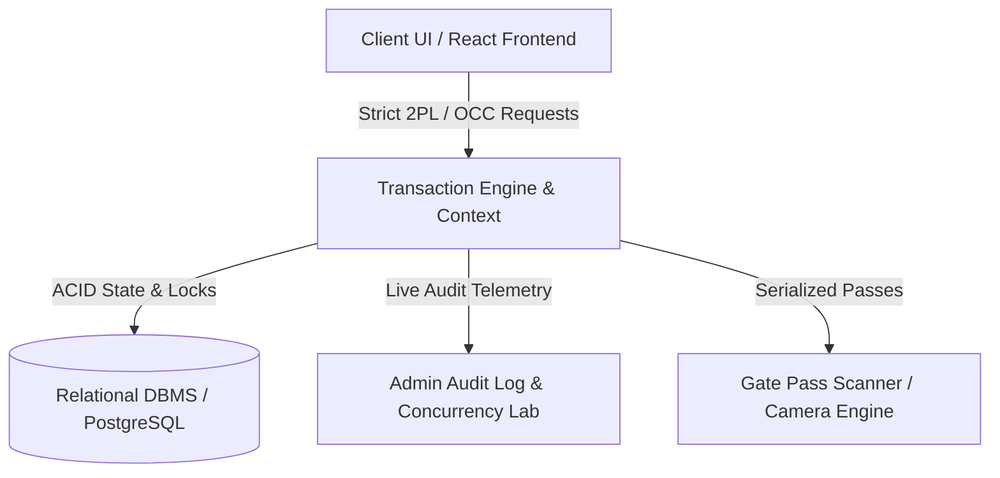
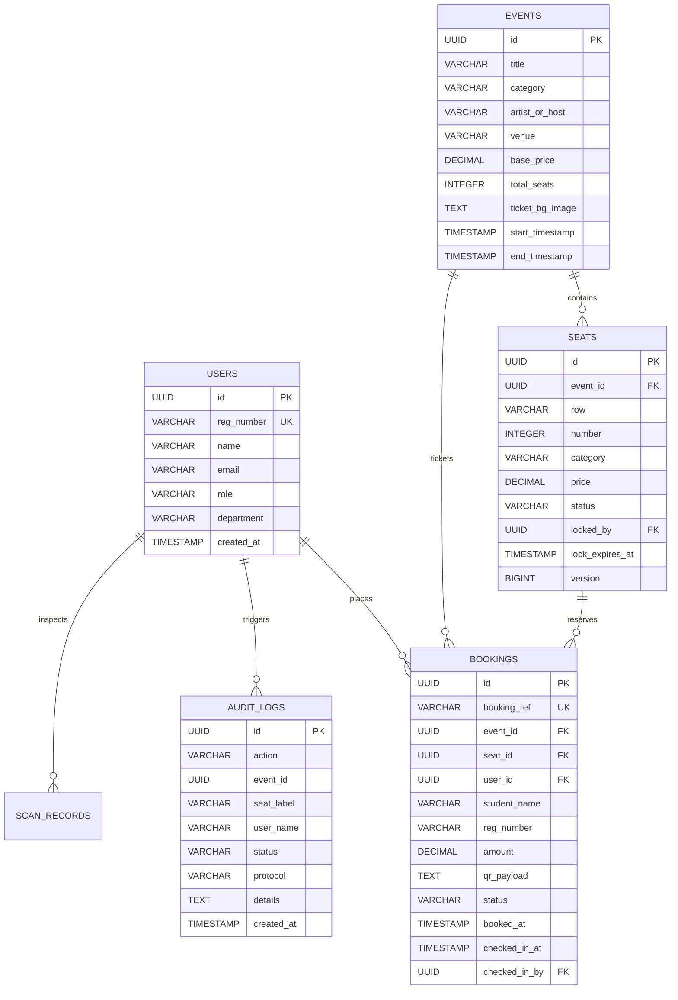

# Vibrance 2026 — DBMS Concurrency & Festival Ticketing Architecture

Comprehensive technical documentation covering frontend mechanics, backend database design, ACID properties, concurrency control algorithms, and access verification.

---

## 1. System Overview & Core Architecture

**Vibrance 2026** is a full-scale DBMS demonstration system designed for college cultural festivals. It tackles the high-contention ticketing problem (such as when thousands of students concurrently attempt to book VIP seats for headline concerts) and demonstrates real-time database transactions, serialization protocols, and access control.



### User Roles & Permission Matrix
| Role | Portal / Access Scope | Key Capabilities |
| :--- | :--- | :--- |
| **Student** | `/events`, `/ticket/:id`, `/my-bookings` | Browse shows, acquire 2PL seat locks, execute transactions, download dynamic QR passes. |
| **Gate Security** | `/verify`, `/verify/history`, `/verify/demo-qr` | Camera viewfinder QR scanner, check-in validation, duplicate interception. |
| **Administrator** | `/admin/*`, `/admin/concurrency-lab`, `/admin/events`, `/admin/users` | Concurrency benchmarks, stage inventory CRUD, staff provisioning, ACID audit stream. |

---

## 2. Frontend Architecture & Functionalities

### 2.1 Event Catalog & Live Stage Schedules (`/events`)
- **Real-Time Schedule Computation**: Shows are categorized dynamically as `LIVE NOW`, `STARTING_SOON` (< 2 hrs), `UPCOMING`, or `CONCLUDED` based on system timestamps.
- **Dynamic Capacity Meter**: Visual progress indicators displaying available (green), locked in transaction (amber), and committed booked seats (red).
- **Interactive Event Details & Live Ticket Preview Modal**:
  - Clicking an event opens a modal with event synopsis, artist information, seat pricing tiers, and a live rendered preview of what the issued festival pass will look like with custom stage artwork.

### 2.2 Interactive Seat Picker & 2-Phase Locking Session (`/events/:id/seats`)
- **SVG / Grid Tiered Seat Map**: Color-coded seat matrix (`VIP_FRONT`, `GOLD`, `REGULAR`) with dynamic pricing multipliers.
- **Seat Lock Acquisition**: Selecting an available seat initiates a transactional exclusive lock (`X-Lock`) on the seat with an active countdown timer (60s).
- **Global Active Hold Banner**: Displays the remaining lock lease time across all routes with a one-click release trigger.
- **Checkout Modal**: Atomic commit modal capturing student registration details, department, and payment method before final transaction serialization.

### 2.3 Ticket Pass Wallet & Digital Pass Rendering (`/my-bookings`, `/ticket/:id`)
- **Dynamic QR Code Generation**:
  - Employs HTML5 Canvas QR code synthesis with serialized payload structure:
    $$\text{Payload} = \text{"VIBRANCE26-TICKET-" } + \text{BookingRef} + \text{"-"} + \text{SeatID} + \text{"-"} + \text{RegNumber}$$
  - Integrated **PNG Download** functionality for offline saving and mobile gate verification.
- **Custom Stage Backgrounds & Clutter-Free Layout**:
  - If a custom photo background is configured for an event, the pass in *My Bookings* renders an unobstructed visual card with compact floating glass pills (`Date/Time`, `Seat`, `Venue`, `Amount`) and rapid-access gate buttons.
- **Torn Pass Physical Metaphor**:
  - Concluded, expired, or checked-in passes are rendered with jagged geometric tear physics (`polygon clip-path`) and ink rubber stamps (`USED`, `CANCELLED`, `EXPIRED`).

### 2.4 Gate Access & Camera QR Scanner Engine (`/verify`)
- **Viewfinder Overlay**: Integrated camera stream with responsive HUD brackets and continuous laser scanning beam animation.
- **Hardware Release & LED Turnoff**: Multi-tier cleanup calling `MediaStreamTrack.stop()` and DOM release immediately upon successful scan, modal close, or route change.
- **Sub-Second Validation**:
  - **First Scan**: Grants access (`ACCESS GRANTED / VALID PASS`), writes check-in timestamp and inspector ID to database state.
  - **Second Scan**: Intercepts duplicate (`DUPLICATE ENTRY ALERT`), identifying original gate inspector and check-in time.
  - **Expired / Counterfeit**: Rejects invalid or concluded passes (`ACCESS DENIED`).

---

## 3. Database Architecture (PostgreSQL / Relational DBMS)

The production database is modeled in a relational schema (PostgreSQL) enforcing foreign key constraints, column checks, and lock versioning.



### PostgreSQL Table Schema (DDL)

```sql
-- 1. User Profiles & Roles
CREATE TABLE users (
    id UUID PRIMARY KEY DEFAULT gen_random_uuid(),
    reg_number VARCHAR(32) UNIQUE NOT NULL,
    name VARCHAR(128) NOT NULL,
    email VARCHAR(128) UNIQUE NOT NULL,
    role VARCHAR(20) NOT NULL CHECK (role IN ('student', 'admin', 'gate_staff')),
    department VARCHAR(128) NOT NULL,
    created_at TIMESTAMP WITH TIME ZONE DEFAULT CURRENT_TIMESTAMP
);

-- 2. Festival Events & Stages
CREATE TABLE events (
    id UUID PRIMARY KEY DEFAULT gen_random_uuid(),
    title VARCHAR(128) NOT NULL,
    category VARCHAR(32) NOT NULL CHECK (category IN ('PRO_SHOW', 'EDM', 'BATTLE_OF_BANDS', 'DANCE', 'HACKATHON', 'COMEDY')),
    artist_or_host VARCHAR(128) NOT NULL,
    venue VARCHAR(128) NOT NULL,
    base_price DECIMAL(10, 2) NOT NULL CHECK (base_price >= 0),
    total_seats INTEGER NOT NULL DEFAULT 48,
    ticket_bg_image TEXT,
    start_timestamp TIMESTAMP WITH TIME ZONE NOT NULL,
    end_timestamp TIMESTAMP WITH TIME ZONE NOT NULL,
    created_at TIMESTAMP WITH TIME ZONE DEFAULT CURRENT_TIMESTAMP
);

-- 3. Seats with Concurrency Versioning & Locks
CREATE TABLE seats (
    id UUID PRIMARY KEY DEFAULT gen_random_uuid(),
    event_id UUID NOT NULL REFERENCES events(id) ON DELETE CASCADE,
    row VARCHAR(4) NOT NULL,
    number INTEGER NOT NULL,
    category VARCHAR(20) NOT NULL CHECK (category IN ('VIP_FRONT', 'GOLD', 'REGULAR')),
    price DECIMAL(10, 2) NOT NULL,
    status VARCHAR(20) NOT NULL DEFAULT 'available' CHECK (status IN ('available', 'locked', 'booked')),
    locked_by UUID REFERENCES users(id) ON DELETE SET NULL,
    lock_expires_at TIMESTAMP WITH TIME ZONE,
    version BIGINT NOT NULL DEFAULT 1,
    CONSTRAINT uq_event_seat UNIQUE (event_id, row, number)
);

-- 4. Serialized Bookings & Gate Verification
CREATE TABLE bookings (
    id UUID PRIMARY KEY DEFAULT gen_random_uuid(),
    booking_ref VARCHAR(32) UNIQUE NOT NULL,
    event_id UUID NOT NULL REFERENCES events(id),
    seat_id UUID NOT NULL REFERENCES seats(id),
    user_id UUID NOT NULL REFERENCES users(id),
    student_name VARCHAR(128) NOT NULL,
    reg_number VARCHAR(32) NOT NULL,
    department VARCHAR(128) NOT NULL,
    amount DECIMAL(10, 2) NOT NULL,
    payment_method VARCHAR(20) NOT NULL CHECK (payment_method IN ('UPI', 'CAMPUS_CARD', 'NET_BANKING')),
    qr_payload TEXT NOT NULL,
    status VARCHAR(20) NOT NULL DEFAULT 'confirmed' CHECK (status IN ('confirmed', 'cancelled', 'checked_in')),
    booked_at TIMESTAMP WITH TIME ZONE DEFAULT CURRENT_TIMESTAMP,
    checked_in_at TIMESTAMP WITH TIME ZONE,
    checked_in_by UUID REFERENCES users(id)
);

-- 5. ACID Transaction Audit Logs
CREATE TABLE audit_logs (
    id UUID PRIMARY KEY DEFAULT gen_random_uuid(),
    action VARCHAR(64) NOT NULL,
    event_id VARCHAR(64),
    event_title VARCHAR(128),
    seat_label VARCHAR(32),
    user_name VARCHAR(128),
    reg_number VARCHAR(32),
    status VARCHAR(32) NOT NULL,
    protocol VARCHAR(64),
    details TEXT,
    created_at TIMESTAMP WITH TIME ZONE DEFAULT CURRENT_TIMESTAMP
);
```

---

## 4. Concurrency Control & Database Features

The central feature of this project is demonstrating **ACID properties** under intense concurrency. The system benchmarks and simulates three database concurrency strategies:

### 4.1 Strategies Compared

```
                ┌─────────────────────────────────────────────────────────┐
                │          HIGH CONTENTION CONCURRENCY STRATEGIES         │
                └─────────────────────────────────────────────────────────┘
                                     │
         ┌───────────────────────────┼───────────────────────────┐
         ▼                           ▼                           ▼
┌──────────────────┐       ┌──────────────────┐       ┌──────────────────┐
│ 1. NO LOCKING    │       │ 2. STRICT 2PL    │       │ 3. OPTIMISTIC CC │
│ (Dirty Read /    │       │ (Pessimistic     │       │ (OCC Version     │
│ Race Conditions) │       │ Row Locking)     │       │ Validation)      │
└──────────────────┘       └──────────────────┘       └──────────────────┘
```

#### 1. No Locking (Naive Baseline)
- **Mechanism**: Reads seat status without acquiring transaction locks. Directly issues `UPDATE seats SET status = 'booked'`.
- **Failure Mode**: When 50 students request the exact same VIP front seat simultaneously:
  - **Overbooking Anomaly**: All 50 transactions read `status = 'available'`.
  - **Data Inconsistency**: All 50 write requests succeed, resulting in 50 tickets issued for 1 physical chair.

#### 2. Strict Two-Phase Locking (Strict 2PL — Pessimistic)
- **Growing Phase**: Transaction requests an exclusive lock (`SELECT ... FOR UPDATE` or `acquireSeatLock()`).
- **Hold Phase**: Exclusive lock is held throughout the entire checkout and payment processing duration.
- **Shrinking Phase**: All locks are released strictly after commit or rollback (at transaction end).
- **Result**: Zero overbooking. First student obtains lock; concurrent requests receive a `409 Conflict / Contention Block`.

#### 3. Optimistic Concurrency Control (OCC — Version Timestamping)
- **Read Phase**: Reads seat record along with current `version` integer (e.g. `version = 4`).
- **Validation / Write Phase**: During commit, validates:
  $$\text{UPDATE seats SET status = 'booked', version = version + 1 WHERE id = :id AND version = :readVersion}$$
- **Result**: If another transaction committed in the interim, version mismatch aborts the transaction (`Conflict Abort`), ensuring serializability without persistent row locking.

---

### 4.2 SQL Transaction Implementations

#### Strict 2PL Reservation Transaction
```sql
-- Step 1: Start Transaction with Strict Isolation
BEGIN TRANSACTION ISOLATION LEVEL REPEATABLE READ;

-- Step 2: Acquire Exclusive Row Lock on Target Seat
SELECT id, status, price, version 
FROM seats 
WHERE id = 'seat-evt-armaan-A1' 
FOR UPDATE;

-- Step 3: Verify Availability within Lock
-- If status != 'available', application issues ROLLBACK

-- Step 4: Reserve Seat
UPDATE seats 
SET status = 'booked',
    locked_by = NULL,
    lock_expires_at = NULL,
    version = version + 1
WHERE id = 'seat-evt-armaan-A1';

-- Step 5: Issue Serialized Pass
INSERT INTO bookings (booking_ref, event_id, seat_id, user_id, student_name, reg_number, department, amount, payment_method, qr_payload, status)
VALUES ('VIB26-PRO-984120', 'evt-armaan', 'seat-evt-armaan-A1', 'usr-std-01', 'Rahul Sharma', 'RA2111003010142', 'CSE', 1049.00, 'UPI', 'VIBRANCE26-TICKET-VIB26-PRO-984120-seat-A1-RA2111003010142', 'confirmed');

-- Step 6: Commit Transaction & Release Locks (Strict 2PL)
COMMIT;
```

#### Automatic Lock Expiration (Lease Protocol)
To prevent orphaned locks when a user closes their tab during checkout:
```sql
-- Background Cron or Trigger to Release Expired Leases
UPDATE seats 
SET status = 'available',
    locked_by = NULL,
    lock_expires_at = NULL
WHERE status = 'locked' 
  AND lock_expires_at < CURRENT_TIMESTAMP;
```

---

## 5. Live Simulation & Benchmark Lab Metrics

In the `/admin/concurrency-lab` portal, administrators can fire automated load tests with 10 to 100 concurrent workers targeting high contention seats.

| Metric | No Locking | Strict 2PL | Optimistic (OCC) |
| :--- | :--- | :--- | :--- |
| **Overbooking Rate** | **High ($> 90\%$)** | **0.0% (Zero Anomaly)** | **0.0% (Zero Anomaly)** |
| **Serializability** | Violates ACID | Full Serializability | Full Serializability |
| **Throughput** | Fast (Erroneous) | Controlled Queue | High (under low contention) |
| **Conflict Handling**| Silent Corruption | Lock Wait / Rejection | Conflict Abort & Rollback |
| **ACID Integrity** | Failed | Committed ($100\%$) | Committed ($100\%$) |

---

## 6. Presentation Quick Talking Points

1. **The Real-World Problem**: College fests face thousands of simultaneous ticket requests when bookings open, causing dirty reads and duplicate seats.
2. **Frontend Solution**: Built a responsive, role-based UI with interactive SVG seat maps, active lock timers, custom stage pass backgrounds, dynamic QR canvas generation, and camera scanners.
3. **Database Solution**: PostgreSQL relational schema backed by Strict 2-Phase Locking (`SELECT FOR UPDATE`) and Optimistic Concurrency Control (Version checking) guaranteeing ACID transactions.
4. **Access Verification**: Every booked pass contains a verifiable QR payload checked against central DB records, intercepting duplicate entries in real time.
